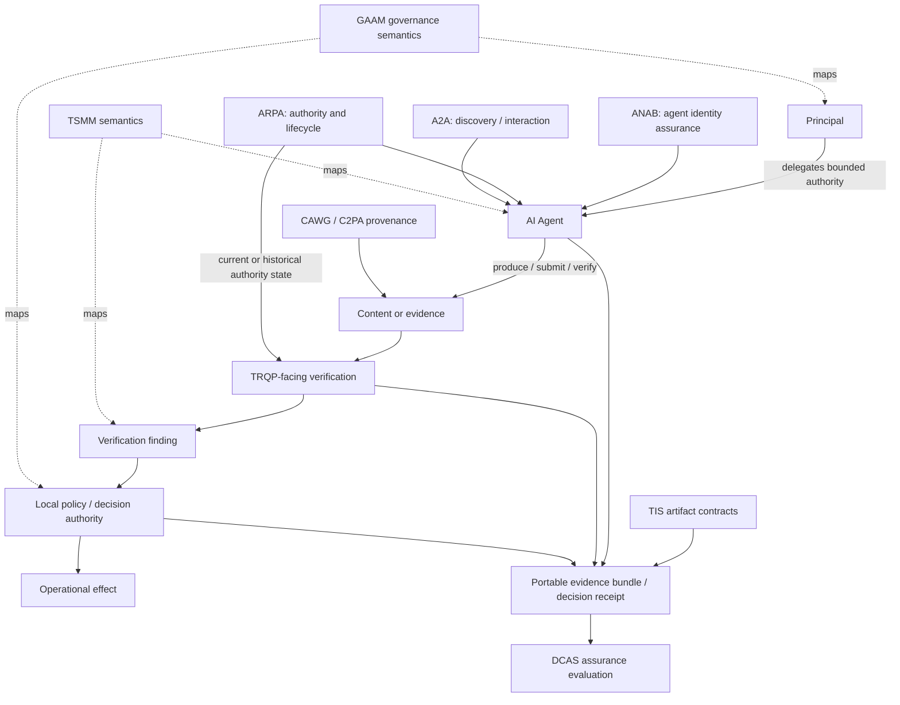

# IC-AGENT-PROVENANCE-AUTH-001 — Agentic provenance and delegated verification

**Status:** Candidate  
**Claim boundary:** Design-time interoperability candidate. No executed cross-implementation interoperability claim is made.

## Question

Can agent identity, delegated authority, content provenance, trust-registry verification, and assurance evidence compose without turning capability, provenance, or verification into unauthorized decision authority?

This case treats an AI agent as a **delegated execution actor**. Merely identifying the agent, proving that content has provenance, or obtaining a successful trust-registry response is insufficient to establish that the agent was authorized to perform the consequential action.

## Why this case exists

Agentic workflows create a semantic compression risk. Systems can incorrectly collapse several independently governed claims into one:

```text
agent identified
  ≠ agent authorized
  ≠ agent authorized for this action
  ≠ content provenance valid
  ≠ underlying claim true
  ≠ verification succeeded
  ≠ downstream decision authorized
  ≠ effect permitted
```

The case therefore tests whether independently governed components can preserve those distinctions end to end.

## Composition



## Semantic ownership

The lab does not redefine any component. It owns only the composition, invariants, scenarios, vectors, findings, and maturity claim for this Interop Case.

- **GAAM** supplies governance/authority/assurance semantics.
- **TSMM** supplies the portable system grammar for authority, delegation, evidence, decision, and effect.
- **TIS** supplies portable machine-readable artifact contracts.
- **ANAB** supplies named-agent identity assurance; identity strength does not imply delegation.
- **ARPA** supplies agent authority, delegation, lifecycle, revocation, and historical authority state.
- **A2A** supplies discovery and interaction mechanics; discoverability/capability does not imply authority.
- **CAWG/C2PA** supplies content provenance/authenticity evidence; provenance does not prove truth or institutional authorization.
- **TRQP** supplies read-only trust-registry query semantics; a successful query does not itself grant decision authority.
- **DCAS** evaluates whether declared evidence is sufficient for a bounded assurance claim; it does not create the underlying authority.

See [ownership.yaml](ownership.yaml) and the [semantic mapping](../../mappings/agentic-provenance-authority.md).

## Assurance contract

An admitted consequential agent action should leave enough portable evidence to reconstruct:

```text
Agent identity
+ Principal
+ Delegation
+ Action scope
+ Resource scope
+ Purpose scope
+ Temporal validity
+ Revocation / lifecycle state
+ Content provenance
+ Verification inputs and result
+ Policy context
+ Decision authority
+ Effect record
+ Redress / replay references
```

The evidence chain MUST preserve the difference between **verification evidence** and **decision/effect authority**.

## Scenarios

1. [Authorized agent content production](scenarios/01-authorized-content-producer.md)
2. [Delegated agent submission](scenarios/02-delegated-submitter.md)
3. [Agentic verifier/orchestrator](scenarios/03-verifier-orchestrator.md)
4. [Revocation between creation and reliance](scenarios/04-revocation-before-reliance.md)
5. [Multi-agent sub-delegation](scenarios/05-subdelegation.md)

## Candidate evidence

Positive and negative vectors under [`vectors/`](vectors/) encode the minimum behavioural expectations for this composition. They are **design-time vectors**: they define what an executed experiment should prove, but they are not executed interoperability evidence.

The execution plan is in [`experiments/agentic-provenance-authority/test-plan.md`](../../experiments/agentic-provenance-authority/test-plan.md).

## RAHP pressure test

The corresponding pressure-test review identifies harms from authority laundering, provenance-to-truth inference, stale delegation, scope expansion, opaque agent chains, and unreviewable automated effects:

[`reviews/rahp/IC-AGENT-PROVENANCE-AUTH-001.md`](../../reviews/rahp/IC-AGENT-PROVENANCE-AUTH-001.md)

## Exit criteria for `Interoperability Tested`

This case MUST NOT advance until an evidence package records:

1. concrete implementation/baseline identifiers and checksums;
2. positive and negative vector execution results;
3. authority-state freshness and historical-resolution behavior;
4. provenance verification output separated from truth/authorization inference;
5. a portable evidence bundle linking agent, principal, delegation, provenance, verification, decision, and effect;
6. deterministic or bounded-replay instructions;
7. explicit failures for scope expansion, stale/revoked authority, and decision-authority collapse.
