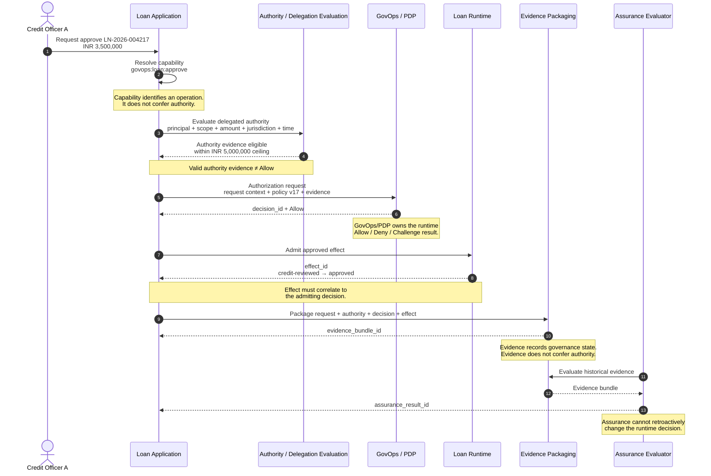
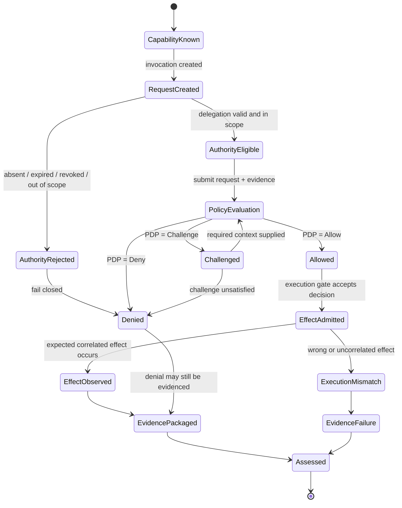
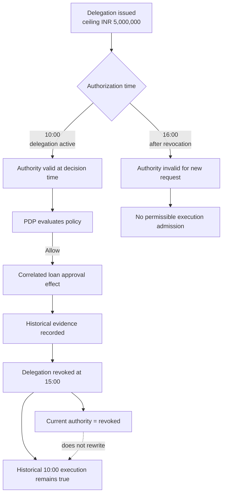
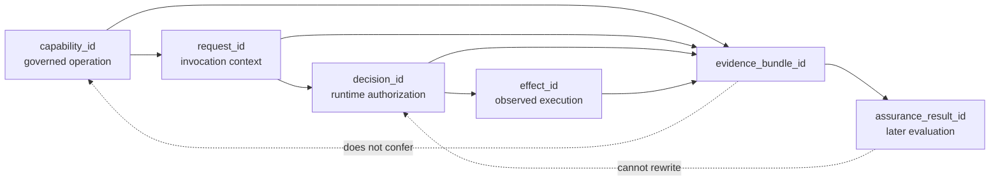

# IC-GOVOPS-EXEC-TRUST-001 — GovOps capability governance and executable trust composition

**Status:** Experimental

**Admission anchor:** [Discussion #6](https://github.com/sankarshanmukhopadhyay/trust-protocol-interop-lab/discussions/6)

Tests whether a GovOps authorization capability can be projected through portable semantic, authority, delegation, decision, execution, and evidence artifacts without changing GovOps capability semantics, transferring runtime authorization authority, or collapsing capability, authority, entitlement, evidence, and assurance boundaries.

## Why this case exists

A governance architecture can appear coherent at the specification level and still fail at the point where independently governed components meet. A capability identifier can be mistaken for permission. Valid delegation evidence can be mistaken for an authorization decision. An `Allow` can become detached from the runtime effect it was supposed to admit. Evidence generated after execution can be treated as if it created authority, or later assurance can be interpreted as retroactive authorization.

This case turns those boundary failures into an explicit interoperability model. The question is not simply whether GovOps, TSMM, GAAM, and TIS can describe the same transaction. The question is whether they can participate in the same governed transaction **without any component acquiring authority that belongs to another component**.

## Admission and maturity decision

The study was admitted at **Exploratory** maturity through PR #7. PR #8 promoted it to **Experimental** by adding a repository-owned mapping and machine-readable scenarios that make the admitted invariants testable without requiring an upstream GovOps change.

Experimental status means the semantic composition is specified well enough to construct executable vectors. It does not establish GovOps conformance, endorsement, production integration, normative alignment, successful execution, or any obligation on GovOpsWG, TSMM, GAAM, or TIS.

## Components and authority boundaries

- **GovOpsWG/GovOps** remains authoritative for GovOps capability and operational-governance architecture.
- **GovOps/PDP policy evaluation** remains authoritative for the runtime `Allow`, `Deny`, or `Challenge` decision represented by this experiment.
- **TSMM** remains authoritative for canonical trust-system semantic projections.
- **GAAM** remains authoritative for the authority, delegation, revocation, accountability, and assurance semantics used by the local mapping.
- **TIS** remains authoritative for portable machine-readable artifact contracts used to represent decision and execution evidence.
- **Trust Protocol Interop Lab** owns only this experimental composition, local mappings, scenarios, vectors, executed evidence, findings, limitations, and maturity claims.

The core semantic boundary is:

```text
Capability
    ≠
Authority
    ≠
Entitlement
    ≠
Authorization decision
    ≠
Execution
    ≠
Evidence
    ≠
Assurance conclusion
```

## Real-world use case: delegated loan approval

The worked example is a bank loan-approval workflow because it has a consequential effect, familiar delegation structures, measurable limits, a clear runtime decision point, and a strong requirement for later evidence.

### Business setting

A bank exposes an internal governed operation that allows an authorized credit officer to approve a loan application. The operation is represented as a GovOps capability:

```yaml
capability_id: govops:loan:approve
operation:
  action: approve
  resource: loan
```

This capability says only that **loan approval is an exposed governed operation**. It does not say that every employee, every credit officer, or even every holder of valid authority evidence may invoke it successfully.

Assume the following actors and parameters:

| Element | Worked value |
|---|---|
| Principal | Credit Officer A |
| Source authority | Regional Credit Manager |
| Delegated action | approve loan |
| Product scope | secured retail loan |
| Jurisdiction | West Bengal, India |
| Delegated monetary ceiling | INR 5,000,000 |
| Delegation status | active |
| Requested loan amount | INR 3,500,000 |
| Capability | `govops:loan:approve` |
| Policy version | `loan-approval-policy:v17` |

The transaction is intentionally ordinary. The value of the experiment comes from making every governance transition observable.

## Swimlane: responsibility and authority through the transaction

The sequence below is the primary responsibility view. It is intentionally asymmetric: each lane contributes a bounded artifact or decision, and no downstream lane is permitted to manufacture authority that belongs upstream.



### What the swimlane makes testable

The diagram exposes six independently testable ownership boundaries: capability publication, authority/delegation evaluation, runtime authorization, effect admission, portable evidence production, and later assurance. A successful vector must preserve the hand-off between lanes rather than flattening them into a single generic "permission" state.

## State flow: authorization and execution

The runtime state machine below separates **request state**, **authority eligibility**, **authorization state**, and **execution state**. In particular, `Allow` is necessary for the tested successful path but is not itself proof that the expected effect occurred.



The critical prohibited transitions are implicit in what is absent from the machine: there is no direct `CapabilityKnown → Allowed`, no `AuthorityEligible → EffectAdmitted`, no `EvidencePackaged → Allowed`, and no `Assessed → Allowed` path.

## Walkthrough: authorized path

### 1. Capability discovery

The application exposes `govops:loan:approve` for the `approve / loan` operation. At this stage the system knows only **what operation exists**. No authority or authorization has been established.

```text
capability_id = govops:loan:approve
```

**Invariant enforced:** capability does not imply identity, entitlement, authority, or permission.

### 2. Request context is created

Credit Officer A requests approval of loan `LN-2026-004217` for INR 3,500,000. The lab profile gives the invocation a separate request correlation identifier:

```yaml
request_id: req:LN-2026-004217:approve:01
capability_id: govops:loan:approve
principal: credit-officer-a
loan_id: LN-2026-004217
amount_inr: 3500000
product: secured-retail-loan
jurisdiction: IN-WB
```

`request_id` is not a replacement for `capability_id`. It identifies this invocation context.

### 3. Authority and delegation are evaluated

GAAM semantics are used to represent the authority chain and its constraints. Credit Officer A has an active delegation from the Regional Credit Manager to approve secured retail loans in West Bengal up to INR 5,000,000.

The requested INR 3,500,000 transaction is within the delegated limit. The delegation is therefore **eligible authority evidence** for policy evaluation. That still does not mean the request is allowed.

```text
valid authority evidence ≠ Allow
```

### 4. GovOps/PDP makes the runtime decision

The request context, applicable policy version, and evaluated evidence are submitted to the GovOps/PDP policy layer. Assume `loan-approval-policy:v17` also checks product eligibility, risk thresholds, maker-checker separation, sanctions screening, and outstanding exposure. Those controls all pass.

The policy layer produces:

```yaml
decision_id: dec:LN-2026-004217:01
request_id: req:LN-2026-004217:approve:01
capability_id: govops:loan:approve
policy_version: loan-approval-policy:v17
result: Allow
```

This is the point at which runtime authorization exists. TSMM, GAAM, TIS, and the lab mapping cannot independently convert `Deny` into `Allow`.

### 5. The effect is admitted and executed

Because the authoritative runtime decision is `Allow`, the loan system admits the effect and changes the loan state from `credit-reviewed` to `approved`.

```yaml
effect_id: effect:LN-2026-004217:approved:01
decision_id: dec:LN-2026-004217:01
loan_id: LN-2026-004217
before: credit-reviewed
after: approved
```

The effect is valid evidence of governed execution only if it can be tied to the decision that admitted it. A different database update, even one affecting the same loan, cannot be substituted for this effect.

### 6. Portable evidence is emitted

TIS artifacts can package the relevant decision and runtime evidence for later audit or assurance:

```yaml
evidence_bundle_id: evidence:LN-2026-004217:01
capability_id: govops:loan:approve
request_id: req:LN-2026-004217:approve:01
decision_id: dec:LN-2026-004217:01
effect_id: effect:LN-2026-004217:approved:01
policy_version: loan-approval-policy:v17
decision: Allow
```

The evidence bundle records what was evaluated, decided, and observed. Possessing this bundle does not grant anyone loan-approval authority.

### 7. Later assurance evaluates the evidence

An assurance process may later test whether the evidence is complete, whether the delegation was valid at decision time, whether policy version `v17` was actually used, and whether the observed state change correlates to the admitted effect.

A positive assurance result can support confidence in the historical execution, but it cannot create authority and cannot change what the runtime decision was.

```text
positive assurance ≠ retroactive authorization
```

## Revocation and historical truth

Revocation is time-relative. The same delegation artifact can correctly support a historical authorization before revocation and correctly fail a later authorization after revocation. The evidence layer must therefore preserve both **decision-time validity** and **current validity** rather than replacing one with the other.



This is a central assurance property: **revocation changes future reliance on authority; it does not mutate truthful history**. An evaluator must be able to answer both “was the authority valid when this decision was made?” and “is the authority valid now?” without conflating the answers.

## Failure path A: delegated amount exceeded

Change only one field:

```yaml
amount_inr: 7500000
```

Credit Officer A is delegated authority only up to INR 5,000,000. The INR 7,500,000 request exceeds the source constraint.

```text
capability exists
  → request created
  → delegation evaluation fails scope/limit check
  → authority input is insufficient
  → no permissible Allow based on that delegation
  → effect must not be admitted
```

The important result is not merely a `Deny`. The evidence must make visible **why the authority path could not support the request**, without treating the capability itself as authority.

## Failure path B: authority revoked before decision

Assume the delegation is revoked at 10:02 and the authorization request is evaluated at 10:04. The previously valid delegation cannot be treated as current authority. An old authority artifact or cached evidence bundle cannot override the revocation state.

```text
revoked before authorization
  → authority invalid for current decision
  → no execution admission
```

## Historical path: authority revoked after execution

Assume instead that the loan was validly approved at 10:00 and the officer's delegation was revoked at 15:00. The revocation changes what the officer may do **after 15:00**. It does not rewrite the earlier authorized execution or invalidate truthful evidence that the 10:00 approval occurred under then-valid authority.

```text
current authority validity ≠ historical execution truth
```

## Failure path C: unrelated effect presented as execution evidence

Assume the PDP produces `Allow` for `LN-2026-004217`, but the evidence bundle points to a status update for `LN-2026-004300` or to a maintenance process that changed the record independently.

```text
Allow + unrelated effect ≠ governed execution
```

## Failure path D: later assurance attempts to repair a denial

Assume the PDP returned `Deny`, but a later audit finds that the officer's delegation document was cryptographically valid and complete. The assurance result may conclude that the authority evidence was authentic. It cannot turn the historical `Deny` into `Allow`, nor can it legitimize an effect that occurred despite the denial.

```text
valid evidence
  + positive assurance
  + historical Deny
  = still not authorized
```

## Identifier and evidence lineage

Separate identifiers preserve separate governance objects. Correlation is explicit and directional rather than inferred from a convenient common key.



| Identifier | What it identifies | Authority owner in this profile |
|---|---|---|
| `capability_id` | exposed governed operation | GovOps |
| `request_id` | one invocation/context | local profile/runtime |
| `decision_id` | one runtime authorization decision | GovOps/PDP decision record |
| `effect_id` | observed execution effect | runtime/evidence layer |
| `evidence_bundle_id` | portable evidence package | TIS-compatible artifact layer |
| `assurance_result_id` | later assurance evaluation | assurance process |

The lab does not assume that GovOps intends `capability_id` to identify requests, decisions, effects, or evidence bundles.

## Experimental mapping

The executable mapping is defined in [`mappings/govops-executable-trust.md`](../../mappings/govops-executable-trust.md). It defines the one-way governance pipeline exercised above:

```text
capability
  -> request context
  -> authority/delegation evaluation
  -> GovOps/PDP policy input
  -> Allow | Deny | Challenge
  -> execution admission
  -> observed effect
  -> portable evidence
  -> later assurance
```

No later stage can create authority or rewrite an earlier runtime decision.

## Scenario estate

[`scenarios/scenarios.yaml`](scenarios/scenarios.yaml) defines seven scenario contracts covering:

1. valid authority plus GovOps/PDP `Allow` and a correctly correlated effect;
2. valid authority with policy `Deny`;
3. delegated authority that exceeds its source limit;
4. authority revoked before the runtime decision;
5. authority revoked after an authorized effect, preserving historical evidence;
6. an unrelated runtime effect that fails decision correlation; and
7. complete evidence plus later positive assurance that cannot retroactively authorize a denied action.

Each scenario references the invariants it exercises and declares expected independent states for authorization, execution, evidence, and assurance. The worked loan-approval narrative above is the human-readable interpretation of those scenario contracts; the next maturity step should derive vectors directly from the same model.

## Experimental constraints

The case remains subject to the ten invariants in `invariants.yaml` and the scope/failure conditions recorded in Discussion #6. In particular:

- `capability_id` remains a GovOps identifier and is not replaced by a TSMM, GAAM, TIS, or lab identifier;
- valid authority evidence does not itself produce `Allow`;
- delegated authority cannot exceed its source;
- the GovOps/PDP policy layer remains authoritative for runtime `Allow`, `Deny`, or `Challenge` decisions;
- executed effects must correlate to the admitting decision and capability;
- evidence and assurance never confer or retroactively create authority; and
- historical execution evidence remains distinct from current authority validity after revocation.

## What this implementation is intended to prove

At Candidate and Interoperability Tested maturity, the implementation should be able to produce machine-verifiable evidence for at least these propositions:

- the same GovOps capability can be invoked by principals with different authority outcomes;
- valid authority is necessary in the tested policy path but is not sufficient to produce `Allow`;
- a delegated ceiling is enforced as a constraint rather than metadata;
- revocation is evaluated relative to decision time;
- `Allow` is necessary but insufficient to prove that the expected runtime effect occurred;
- the runtime effect must correlate to its admitting decision;
- portable evidence records authority and decision state without becoming authority; and
- assurance evaluates historical evidence without changing historical authorization state.

These are stronger claims than schema compatibility. They are observable governance properties.

## Open architectural dependency

The experiment still does **not** resolve whether GovOps intends `capability_id` to be the durable correlation key across authorization, execution, observation, and externally represented governance evidence. That remains an attributable upstream clarification item. Until authoritative upstream guidance exists, the lab profile preserves `capability_id` as the capability reference and uses separate lifecycle correlation identifiers.

## Next maturity gate

Promotion to **Candidate** requires positive and negative executable vectors, explicit expected behavior, and known limitations. Those vectors should be derived directly from the seven scenario contracts rather than introducing a second semantic model.

A subsequent **Interoperability Tested** claim requires a deterministic evaluator, executed results, reproduction command, and hash-bound evidence manifest.

## Explicit exclusions

The current iteration excludes PolicyMesh, Agent Registry Protocol, Agent Name Assurance Baseline, TRQP, RAHP, DTG conformance/assurance, agent-specific workflows, credential protocols, portfolio-monitor integration, changes to GovOps/Gemara/AuthZEN/PARC, and new policy or entitlement languages.
