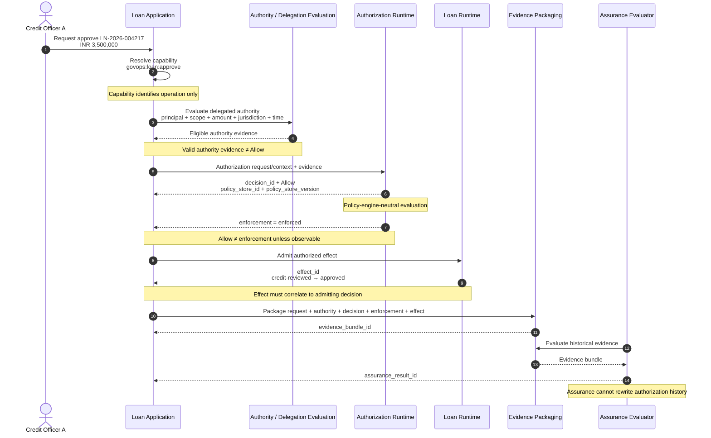
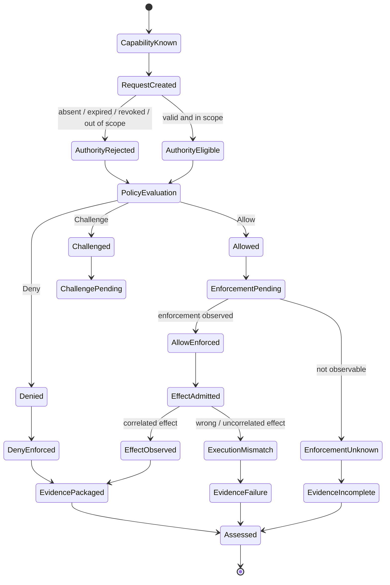
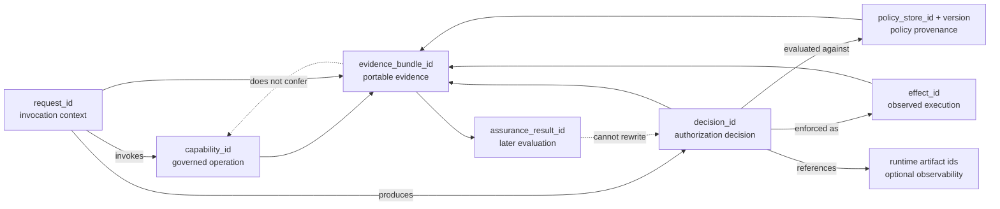
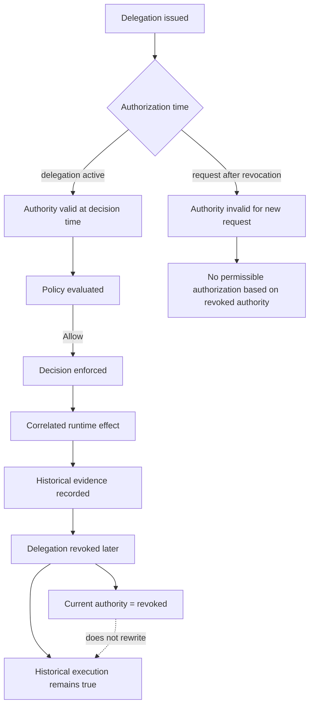

# IC-GOVOPS-EXEC-TRUST-001 — GovOps capability governance and executable trust composition

**Status:** Candidate  
**Admission / judgment anchor:** [Discussion #6](https://github.com/sankarshanmukhopadhyay/trust-protocol-interop-lab/discussions/6)  
**Boundary-alignment issue:** [#82](https://github.com/sankarshanmukhopadhyay/trust-protocol-interop-lab/issues/82)  
**Candidate-promotion issue:** [#85](https://github.com/sankarshanmukhopadhyay/trust-protocol-interop-lab/issues/85)

Tests whether a GovOps capability can participate in a portable authority, delegation, authorization, enforcement, execution, evidence, and assurance flow without changing GovOps capability semantics, transferring semantic ownership, or collapsing distinct governance states.

## At a glance

| Item | Current state |
|---|---|
| **Status** | Candidate |
| **Purpose** | Show how a governed capability moves through authority, policy decision, enforcement, runtime effect, evidence, and later assurance without those governance states becoming interchangeable. |
| **Concrete scenario** | A delegated credit officer attempts a bounded loan approval under GovOps policy. |
| **Current conclusion** | The composition is semantically stable and executable: capability, authority, authorization, enforcement, effect, evidence, and assurance remain distinct and observable. |
| **Evidence today** | Ten scenario/vector contracts across twelve invariants and a deterministic evaluator. A stronger hash-bound evidence manifest is still required for Interoperability Tested. |

## Why this matters to a new reader

A great many governance systems stop at "policy returned Allow". This case asks what must still be true after that point. Did the decision actually get enforced? Did the intended effect occur? Can the effect be correlated to the decision? Was the authority current at decision time? Can later assurance explain the history without rewriting it?

## The composition in plain language

**GovOps** identifies and governs the capability/policy boundary. **GAAM** supplies authority/delegation semantics. **TSMM** supplies canonical trust-system concepts. **TIS** supplies portable evidence contracts. A policy-engine-neutral runtime evaluates and enforces the decision.

The Lab intentionally preserves:

```text
capability -> authority input -> policy decision -> enforcement -> effect -> evidence -> assurance
```

as separate stages.

## Concrete scenario

A Regional Credit Manager delegates approval authority up to INR 5,000,000 to Credit Officer A. The officer requests approval of an INR 3,500,000 loan.

The capability `govops:loan:approve` only identifies the governed operation. The system separately evaluates delegation scope, policy, enforcement, and the resulting runtime effect, then packages evidence for later assurance.

## Where it resolved

The Candidate evidence establishes that valid authority is necessary input but does not itself create `Allow`; `Allow` does not prove enforcement; enforcement does not prove the intended effect; correlation identifiers are not authority; policy provenance must remain inspectable; revocation is time-relative; and later assurance cannot retroactively authorize a denied action.

The remaining gate is the repository's stronger `Interoperability Tested` evidence package, not another semantic rewrite.


## What remains unresolved

Candidate evidence is strong at the semantic/evaluator level, but the stronger Tested gate still requires reproducible execution evidence and a hash-bound evidence manifest. Wire-level interoperability, production enforcement integrations, and external certification remain outside the claim.

## Current architectural conclusion

Discussion #6 produced an important correction and several boundary clarifications that now govern this case:

- GovOps is **policy-engine-neutral**. This case does not model a normative “GovOps/PDP layer”.
- portable authority/delegation evidence is an **input to authorization**, alongside identity, credentials, attestations, and other contextual evidence; it is not authorization itself;
- the GovOps authorization boundary ends when applicable policy has been evaluated **and the resulting decision has been enforced**;
- request representation is moving toward PARC, so this experiment keeps a **P**olicy **A**uthorization **R**equest **C**ontext-compatible action/resource projection without making PARC a normative dependency;
- runtime governance correlation is intentionally multi-identifier: `capability_id`, `decision_id`, `policy_store_id`, `policy_store_version`, relevant artifact identifiers, and local request/effect/evidence identifiers remain separate;
- current authority validity and historical execution truth remain distinct: later revocation does not rewrite truthful historical evidence.

These clarifications are now represented by ten explicit positive/negative vectors across twelve invariants. The deterministic evaluator verifies that the vectors remain mechanically equivalent to the scenario contracts. That evidence is sufficient for **Candidate** maturity under the repository's evidence gate, but not for an `interoperability-tested` claim.

## Why this case exists

A governance composition can fail even when each participating component is internally coherent. Common failure modes include:

- capability identity being mistaken for permission;
- valid authority or delegation evidence being mistaken for `Allow`;
- an `Allow` being treated as proof that the decision was actually enforced;
- an enforced decision becoming detached from the runtime effect it admitted;
- a valid `decision_id` from another transaction being substituted into evidence;
- policy provenance becoming ambiguous because the evaluated policy store/version is not observable;
- evidence being interpreted as if it creates authority; or
- a later assurance conclusion being treated as retroactive authorization.

This case turns those risks into explicit, machine-testable governance propositions.

## Authority and responsibility boundaries

| Concern | Owner / boundary in this experiment | What it does not imply |
|---|---|---|
| GovOps capability and operational-governance architecture | GovOpsWG/GovOps | authority, entitlement, a mandated policy engine |
| request/context shape | requesting/runtime system; PARC-aligned locally | authority or permission |
| authority, delegation, attenuation, revocation | GAAM projection | runtime `Allow` |
| canonical trust-system semantics | TSMM | GovOps semantic authority |
| policy evaluation | policy-engine-neutral authorization runtime | successful enforcement |
| decision enforcement | policy-engine-neutral authorization runtime | proof of intended runtime effect |
| decision/effect evidence packaging | TIS-compatible local profile | authority or entitlement |
| correlation profile and experiment | Trust Protocol Interop Lab | upstream normative status |
| later assurance | local/TIS-compatible evaluator | retroactive authorization |

The core invariant remains:

```text
Capability
    ≠
Authority
    ≠
Entitlement
    ≠
Authorization decision
    ≠
Enforcement
    ≠
Execution
    ≠
Evidence
    ≠
Assurance conclusion
```

## Worked case: delegated loan approval

A Regional Credit Manager delegates authority to Credit Officer A to approve secured retail loans in West Bengal up to INR 5,000,000. Credit Officer A attempts to approve an INR 3,500,000 loan using:

```yaml
capability_id: govops:loan:approve
operation:
  action: approve
  resource: loan
```

The capability identifies the governed operation only. The transaction then moves through separate governance states:

```text
capability resolution
  -> request/context creation
  -> authority/delegation evaluation
  -> authorization evaluation
  -> decision observability
  -> decision enforcement
  -> effect admission and observation
  -> portable evidence
  -> later assurance
```

## Responsibility swimlane



## Authorization and execution state flow



There is deliberately no direct transition from capability or authority to `Allowed`, and no transition from `Allowed` directly to successful execution. Enforcement is a distinct observable boundary.

## PARC-aligned request projection

Discussion #6 indicates a direction toward PARC for request shape because action/resource maps naturally to a GovOps capability. This case records that direction without claiming PARC conformance or requiring an upstream change:

```yaml
request_id: req:LN-2026-004217:approve:01
principal_ref: credit-officer-a
capability_id: govops:loan:approve
action: approve
resource: loan
context:
  loan_id: LN-2026-004217
  amount_inr: 3500000
  jurisdiction: IN-WB
```

`request_id` identifies one invocation context. It does not replace `capability_id` and does not create authority.

## Authorization observability

The authorization runtime is implementation-neutral. It may be a conventional PDP, a proxy, a framework, or another decision/enforcement system. The experiment therefore tests behavior rather than product topology.

A successful authorization record should expose enough information to reconstruct the governance decision and enforcement lineage:

```yaml
decision_id: dec:LN-2026-004217:01
request_id: req:LN-2026-004217:approve:01
capability_id: govops:loan:approve
policy_store_id: loan-policy-store
policy_store_version: "17"
runtime_artifact_ids:
  - transaction_token.jti: txn-7e62...
result: Allow
enforcement_state: enforced
```

Runtime artifact identifiers are optional examples of observable correlation material. Their presence does not confer authority or prove successful execution.

## Identifier and evidence lineage

Correlation is a graph, not a single overloaded transaction key.



| Identifier | Meaning | Ownership / source |
|---|---|---|
| `capability_id` | exposed governed operation | GovOps |
| `request_id` | one invocation/context | local request/runtime |
| `decision_id` | one authorization decision | authorization runtime |
| `policy_store_id` | evaluated policy store | authorization runtime |
| `policy_store_version` | exact evaluated policy state | authorization runtime |
| runtime artifact IDs | optional observable runtime artifacts, e.g. token `jti` | runtime |
| `effect_id` | observed runtime effect | runtime/evidence layer |
| `evidence_bundle_id` | portable evidence package | TIS-compatible layer |
| `assurance_result_id` | later evidence evaluation | assurance process |

## Revocation and historical truth



Revocation changes whether authority may be exercised now or in the future. It does not retroactively rewrite truthful evidence of an execution that occurred while the relevant authority and policy conditions were valid.

## Machine-readable invariants

[`invariants.yaml`](invariants.yaml) contains twelve invariants. Two invariants make the upstream observability clarification executable:

- **INV-GOVOPS-011 — authorization observability:** the decision and enforcement path must expose enough stable identifiers to correlate capability, decision, applicable policy state, and relevant runtime artifacts without collapsing ownership;
- **INV-GOVOPS-012 — correlation is not authority:** correlation identifiers and observability artifacts do not constitute authority, entitlement, authorization, successful enforcement, or proof of the intended runtime effect.

The earlier authority, delegation, revocation, evidence, and assurance invariants remain in force.

## Scenario and vector estate

[`scenarios/scenarios.yaml`](scenarios/scenarios.yaml) defines ten machine-readable scenario contracts. [`vectors/`](vectors/) materializes each contract as an explicit Candidate vector:

1. valid authority + `Allow` + observable enforcement + correlated effect;
2. valid authority does not override `Deny`;
3. over-broad delegation is inadmissible authority input;
4. pre-decision revocation invalidates authority input;
5. post-execution revocation preserves historical truth;
6. an uncorrelated effect fails evidence correlation;
7. later assurance cannot retro-authorize a denied action;
8. **`Allow` without observable enforcement does not establish successful authorization execution**;
9. **decision identifier substitution fails correlation**; and
10. **missing `policy_store_version` leaves policy provenance and assurance indeterminate**.

The evaluator checks one-to-one scenario coverage and rejects drift between scenario inputs/expected outcomes and their vector representation.

## Failure semantics

The experiment must fail closed or preserve indeterminacy when evidence is insufficient. In particular:

```text
valid authority != Allow
Allow != enforcement
observable decision != successful execution
valid decision_id != valid correlation
missing policy version != assurance pass
evidence != authority
positive assurance != retroactive authorization
```

Missing evidence remains missing evidence; it is not converted to success.

## Experimental mapping

The normative-for-this-experiment mapping is [`mappings/govops-executable-trust.md`](../../mappings/govops-executable-trust.md). It defines the executable local pipeline:

```text
capability
  -> request/context
  -> authority/delegation evidence
  -> policy-engine-neutral authorization evaluation
  -> Allow | Deny | Challenge
  -> decision enforcement
  -> runtime effect
  -> portable evidence
  -> later assurance
```

The lab owns this composition only. It does not redefine GovOps, TSMM, GAAM, TIS, or PARC.

## What the Candidate evidence establishes

The deterministic evaluator and explicit vector estate establish, within this repository-owned semantic reference model, that:

- the same GovOps capability can be invoked under different authority and policy outcomes;
- valid authority is authorization input but is not sufficient to produce `Allow`;
- delegated limits are constraints rather than merely recorded metadata;
- revocation is evaluated relative to decision time;
- `Allow` alone does not prove enforcement;
- enforcement alone does not prove the intended effect occurred;
- the effect must correlate to the decision that admitted it;
- correlation identifiers remain non-authoritative observability artifacts;
- policy provenance remains inspectable through policy store/version identifiers;
- evidence records governance state without becoming authority; and
- assurance evaluates historical evidence without rewriting historical authorization state.

These are semantic-composition claims only. The limitations are recorded in [`known-limitations.md`](known-limitations.md).

## Maturity gate

The case is now **Candidate** because it has explicit positive and negative vectors, deterministic expected behavior, recorded limitations, and a deterministic evaluator that rejects vector/scenario drift.

**Candidate → Interoperability Tested** still requires the stronger evidence defined in `GOVERNANCE.md`, including reproducible execution evidence and a hash-bound evidence manifest with an appropriately narrow claim boundary.

Candidate maturity does not establish GovOps conformance, endorsement, production integration, wire-level interoperability, external certification, or normative alignment.

## Explicit exclusions

This iteration does not add PolicyMesh, ARPA, ANAB, TRQP, RAHP, DTG conformance/assurance, agent-specific workflows, credential protocols, portfolio-monitor integration, changes to GovOps/Gemara/AuthZEN/PARC, or a new policy/entitlement language.

The purpose of this wave is narrow: preserve the upstream GovOps boundary accurately and make the clarified observability and enforcement properties executable and reviewable.
