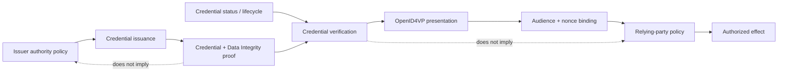

# XSP-001 — Verifiable credential issuance → proof → presentation → reliance

**Interop Case:** `IC-XSP-001`  
**Status:** `interoperability-tested`  
**Evidence scope:** executed semantic-composition interoperability; **not** wire-protocol conformance, certification, or a claim that any upstream specification is defective.

## Question

Can a verifier preserve issuer authority, credential lifecycle, proof purpose, presentation audience/freshness, and relying-party policy as separately testable semantics across issuance, securing, presentation, and reliance?

## Baselines

| Component | Pinned baseline | Authority |
|---|---|---|
| VC Data Model | W3C Recommendation 2.0, 2025-05-15 | W3C |
| VC Data Integrity | W3C Recommendation 1.0, 2025-05-15 | W3C |
| OpenID4VCI | OpenID Final Specification 1.0, 2025-09-16 | OpenID Foundation |
| OpenID4VP | OpenID Final Specification 1.0, 2025-07-09 | OpenID Foundation |

The canonical publisher URLs and lifecycle evidence are retained in [`standards/register.yaml`](../../standards/register.yaml). GSMI/GBBC is credited as the standards-discovery source; the publishers above remain authoritative.

## Finding

**The composition is viable only when five control planes remain explicit.** Cryptographic proof verification, credential status, issuer authority, presentation transaction binding, and the relying party's authorization/effect decision are related but non-substitutable checks.

The executed vectors demonstrate that the composition model fails closed when any of those semantics is collapsed. In particular, a valid proof does not establish that the verifier trusts the issuer for the relevant claim or purpose. VC Data Model v2.0 expressly leaves issuer trust decisions to the verifier. OpenID4VP binds presentations to verifier audience and transaction freshness, but the final relying decision remains application policy.

## Composition boundary

## Executed assurance result

| Measure | Result |
|---|---:|
| Positive vectors | 4/4 pass |
| Negative vectors | 6/6 correctly rejected |
| Invariants exercised | 8 |
| Executed evaluator | `experiments/xsp-001/run.py` |
| Evidence manifest | `evidence/xsp-001/evidence-manifest.json` |

See the [result](../../evidence/xsp-001/result.json), [reproduction instructions](../../experiments/xsp-001/README.md), [source basis](source-basis.md), [known limitations](known-limitations.md), and [RAHP review](../../reviews/rahp/IC-XSP-001.md).

## Assurance conclusion

A conforming deployment profile should make the following independently observable at the reliance boundary: issuer-authority source and scope; proof verification result and proof purpose; current credential lifecycle/status where material; presentation audience and freshness; and the policy/actor responsible for the final effect. None should be inferred solely from successful execution of another layer.
