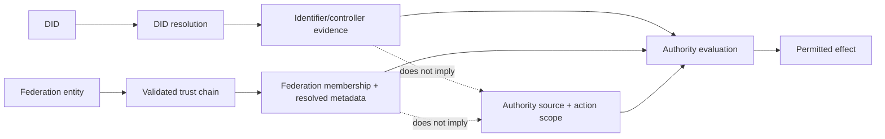

# XSP-002 — DID resolution × federation metadata × authority

**Interop Case:** `IC-XSP-002`  
**Status:** `interoperability-tested`  
**Evidence scope:** executed semantic-composition interoperability; **not** DID-method conformance, OpenID Federation conformance, organizational certification, or legal-authority determination.

## At a glance

| Item | Current state |
|---|---|
| **Status** | Interoperability Tested |
| **Purpose** | Test whether DID resolution and OpenID Federation membership/metadata can contribute trust evidence without being mistaken for organizational authority or permission for a consequential action. |
| **Current conclusion** | Identifier control, federation membership, organizational authority, and action-specific scope are four different assertions and must remain independently attributable. |
| **Evidence today** | 4/4 positive and 7/7 negative vectors passed in the semantic evaluator, with eight invariants and a governed evidence manifest. |

## Why this matters to a new reader

A DID that resolves successfully proves something about identifier/controller material. A valid federation trust chain proves membership in a federation rooted at a selected trust anchor and yields metadata under federation policy. Neither fact automatically proves that the entity has a particular organizational role or may perform the requested action.

## Concrete scenario

A service resolves a DID and validates an OpenID Federation chain for the same entity. Before allowing a consequential operation, it still needs an independently governed source of organizational/role authority plus the action scope applicable at that decision time.

## Where it resolved

The case reached **Interoperability Tested** for the bounded semantic composition. The evaluator demonstrates that resolution evidence and federation evidence may inform authority evaluation but cannot widen or manufacture the authority source itself.

No upstream defect is asserted; the result is best understood as a composition/profile requirement.

## What remains unresolved

The current Tested claim is semantic-composition interoperability only. DID-method-specific resolution behavior, live OpenID Federation interoperability, independently operated organizational-authority sources, and external certification remain outside the evidence.

## Question

When a DID resolves successfully and an entity has a valid OpenID Federation trust chain, which layer proves identifier control, federation membership, organizational authority, and action scope?

## Baselines

| Component | Pinned baseline | Authority |
|---|---|---|
| DID Core | W3C Recommendation 1.0, 2022-07-19 | W3C |
| DID Resolution | W3C Candidate Recommendation Snapshot, 2026-08-06 | W3C |
| OpenID Federation | OpenID Final Specification 1.0, 2026-02-17 | OpenID Foundation |

## Finding

**Resolution and federation compose safely only if their assurance meanings remain bounded.** DID resolution can supply current identifier/controller material and resolution metadata. OpenID Federation can establish membership in a federation rooted at a selected trust anchor and derive metadata under federation policy. Neither fact, alone or together, establishes every organizational role, delegated action scope, or permission to produce a consequential effect.

OpenID Federation explicitly describes a validated trust chain as proof that the subject is a member of the federation rooted at the trust anchor, then applies federation policy to derive metadata. Application-level authority still requires a separately governed interpretation of that metadata.

## Composition boundary

## Executed assurance result

| Measure | Result |
|---|---:|
| Positive vectors | 4/4 pass |
| Negative vectors | 7/7 correctly rejected |
| Invariants exercised | 8 |
| Executed evaluator | `experiments/xsp-002/run.py` |
| Evidence manifest | `evidence/xsp-002/evidence-manifest.json` |

See the [result](../../evidence/xsp-002/result.json), [reproduction instructions](../../experiments/xsp-002/README.md), [source basis](source-basis.md), [known limitations](known-limitations.md), and [RAHP review](../../reviews/rahp/IC-XSP-002.md).

## Assurance conclusion

A production composition should expose four different assertions: current identifier/controller evidence; federation membership and resolved metadata; organizational/role authority from an identified governance source; and action-specific scope at the decision time. Local or federation policy may constrain authority, but a trust-chain success must never widen authority beyond the source that granted it.

## Upstream / next disposition

No upstream defect is asserted by this case. The result should instead be used as a profile/composition requirement: implementations that combine DID resolution and OpenID Federation should preserve an independently attributable organizational-authority source and action-specific scope at the relying decision boundary.

A future promotion beyond this semantic reference model would require implementation-level or wire-level evidence against pinned DID method, DID Resolution, and OpenID Federation implementations. Until then, the current `interoperability-tested` claim remains bounded to the executed semantic composition documented here.
